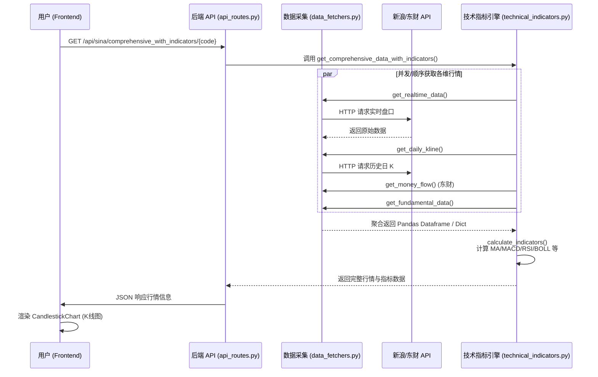
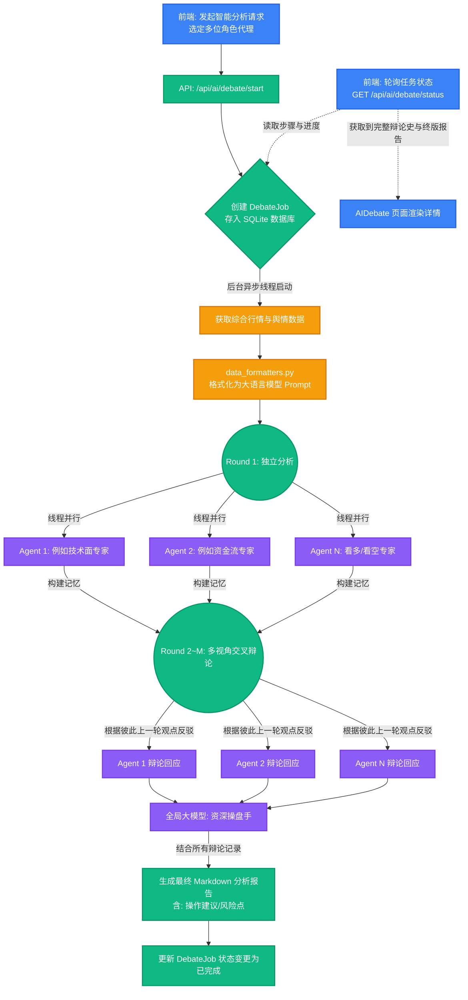

这是一个非常典型的前后端分离架构，并且结合了时下流行的 **LLM (大语言模型) 多 Agent 辩论框架** 和**金融量化分析**功能。

以下是对该项目（A-Stock Trading A股交易分析系统）的项目结构深度分析以及核心数据流程图。

### 一、 核心项目结构分析

这个系统分为两个主要部分：**Python (Flask) 后端** 和 **React (Vite) 前端**。

#### 1. 后端架构 (Python)
后端负责行情数据抓取、技术指标运算、系统配制管理、以及调度不同 AI 模型进行研报辩论。

*   **入口与路由 (Web 层):**
    *   `api_server.py`: Flask 服务入口，负责系统启动与端口绑定（现运行在 5001），初始化跨域 (CORS) 和数据库。
    *   `api_routes.py`: 核心路由控制器，定义了海量 API，负责接收前端请求并分发给不同模块。包含股票查询、自选股管理、舆情抓取、Agent 配置和多 Agent 辩论调度逻辑（多线程异步工作）。
*   **核心业务层 (业务逻辑 & AI 服务):**
    *   `ai_service.py`: 统一的标准化大模型调用接口。封装了对多家大模型（OpenAI, DeepSeek, 阿里通义千问, Gemini, 硅基流动, Grok）的 API 请求，并具备错误重试机制。
    *   `technical_indicators.py`: 技术分析引擎。利用 Pandas 和 NumPy 对 K 线数据进行二次加工，计算包括 MA, EMA, MACD, RSI, KDJ, BOLL, OBV 等股票技术指标。
    *   `init_agents.py` & `reset_agents.py`: 系统内置专家 AI 的定义，例如：“技术分析Agent”、“基本面Agent”、“看多/看空Agent”等。附带了精心设定的系统提示词（Prompt）用于身份设定与辩论指引。
*   **数据采集层 (Data Fetchers):**
    *   `data_fetchers.py`: 爬虫与第三方 API 接入。负责从 **新浪财经** 和 **东方财富** 抓取实时行情、K 线数据、资金流向（超大单/主买主卖）、基本面数据（市盈率/流通市值等）和板块行业对比信息。
*   **数据格式化层:**
    *   `data_formatters.py`: 数据清洗装配。一个重要功能是将大量的 DataFrame 行情数据转换为 **"AI 友好" 的结构化自然语言文本（或 Markdown）**，组装成 Prompt 给 Agent 消费。
*   **数据库层 (ORM):**
    *   `models.py`: 基于 SQLAlchemy 定义关系型数据库表结构（自选股 `Watchlist`、配置 `Config`、智能体 `Agent`、辩论任务 `DebateJob` 等）。
    *   `db.py`: 封装了所有的 CRUD（增删改查）操作方法。使用本地 SQLite (`database.db`) 存储。

#### 2. 前端架构 (React + Vite + TypeScript)
前端提供现代化重体验的交易与监控面板，核心采用 TailwindCSS 进行响应式绘制。

*   **状态与通信:**
    *   `src/store/`: 状态管理（Zustand）。`configStore.ts` 存储大模型 API Keys 和后端地址，`watchlistStore.ts` 管理本地自选股缓存。
    *   `src/services/api.ts`: 基于 fetch 封装的 API 客户端接口集，包含对后端数据的所有强类型 (TypeScript API) 映射。
*   **视图层 (Pages):**
    *   `Home.tsx` (首页): 宏观三大指数看板与自选股快速展示。
    *   `StockDetail.tsx` (个股详情页): 个股全景试图，显示复杂的图表与数据。
    *   `AIDebate.tsx`: 多 Agent 辩论详情可视化，能呈现 AI "切磋" 的过程记录和最终投资建议书。
    *   `Tasks.tsx` & `Strategy.tsx`: 辩论任务列表与特定股票筛选策略。
    *   `Settings.tsx`: 模型提供商（Provider）设置及 API Key 注入管理面板。
*   **组件 (Components):** 包含 `CandlestickChart.tsx` 等通过可视化库渲染的复杂交易 K 线图表。

---

### 二、 核心数据流程图

这里有两个最关键的数据流转链路：**常规看盘数据流** 和 **AI 大模型沉浸式辩论流**。

#### 1. 常规行情数据获取流程 (看盘流程)
主要展示前端如何索取并展示股票分析指标：

#### 2. 最具特色的 "多 Agent 辩论" 数据与调度流程
这个流程是该项目最大的亮点，允许多个角色设定不同的 AI 大模型进行多轮辩论，最后生成综合投资建议。

### 三、 架构设计亮点
1. **重度 Prompt 数据工程**：项目利用 Pandas 对金融数据进行运算后，通过 `format_for_ai()` 把海量数据转换为精确的自然语言供大模型阅读。这就解决了大模型无法直接处理图表或大体积 JSON 的难点。
2. **异步执行与状态分离**：AI 辩论通常会消耗大量时间（数十秒甚至几分钟），后端采用了 `ThreadPoolExecutor` 并在 SQLite 中生成一个 `DebateJob`，前端通过不断轮询(`setInterval`/`react-query`)以加载百分比无缝获取最新进度，用户体验很好。
3. **隔离与可扩展的 AI 层**：`ai_service.py` 作为一个适配器代理(Adapter API)，轻易兼容并实现了统一的 Open API 范式，使得未来接入哪怕是本地模型（如 Ollama）都只需要修改几行代码配置而已。